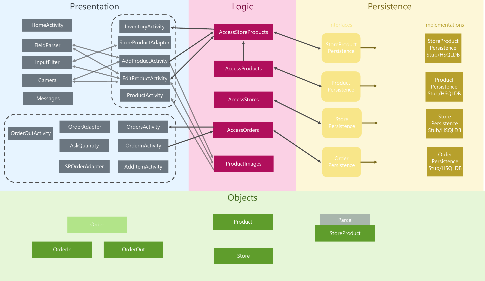

# Packages

comp3350.ei:
- comp3350.ei.application
    - Services
- [comp3350.ei.business](#business-logic-layer)
- [comp3350.ei.objects](#domain-objects)
- [comp3350.ei.persistence](#persistence-layer)
- [comp3350.ei.presentation](#presentation-layer)
    - .inventory: everything related specifically to the activities under the "Inventory" button
    - .orders: everything related specifically to the activities under the "Orders" button
    - .SwipeController: classes related to the reusable component used in several adapters

## Presentation Layer

- #### Messages

    Alerts and warnings

- #### HomeActivity

    The main landing page, with links to InventoryActivity and OrdersActivity 

- #### OrdersActivity

    Shows a list of orders (not currently clickable) using its adapter

    Links to OrderActivity by clicking on the button in the bottom left

    Back-links to Home

- #### InventoryActivity

    Shows a list of all StoreProducts from AccessStoreProducts

    Links to AddProductActivity by clicking on the "+" button

    Links to ProductActivity by clicking on any product

    Uses an adapter to display the list of StoreProducts

    Back-links to HomeActivity

- #### AddProductActivity

    Creates a new StoreProduct and its associated Product, if not duplicate by sending the input information to AccessStoreProducts

    Can create a picture by clicking on the default image space

    Back-links to InventoryActivity

- #### ProductActivity

    Displays a StoreProduct's information, received from the View that opened this one
    
    Back-links to InventoryActivity

- #### EditProductActivity

    Edits a StoreProduct's information by sending it and validating it through AccessStoreProducts
    
    Can change the picture by clicking on the current picture
    
    Back-links to ProductActivity
    
- #### OrderActivity

    Creates a new OrderIn

    Links to AddItemActivity, which it receives input back from and adds the product and quantity to the order

    Displays the products currently in the order, their quantity and price for all the quantity
    
    Back-links to OrdersActivity
    
- #### AddItemActivity

    Displays the list of storeproducts

    When one is clicked on, it asks for the quantity and then returns to OrderActivity

    Back-links to OrderActivity

- #### Camera

    Collection of functions to use the camera app to obtain pictures of the products

- #### FieldParser

    Does input error-checking for numbers, and converts them

- #### DecimalDigitsInputFilter

    Filters the Activity itself so that the input cannot fall outside of certain constraints

- #### ImageViewManager

    Records default image and provides less method calls for the Activities to set an ImageView/picture in app

- #### StoreProductParcel

    Parcels a StoreProduct so that it may be sent between views

- #### Adapters

    There are several adapters, which take a list and convert it to a certain view

    #### 

## Business (logic) Layer

- #### AccessStoreProducts

    Communicates with StoreProductPersistence Interface 
    
    Creates a Product for the StoreProduct if necessary by communicating with AccessProducts

- #### AccessProducts

    Communicates with ProductPersistence Interface

- #### AccessOrders

    Contains a list of orders

- #### AccessStores

    Contains a list of stores

- #### ProductImages

    Contains functions for loading and saving an image to the file system
    
    

## Persistence Layer

- #### ProductPersistenceInterface & Implementations

    Contains a list of Products

- #### StoreProductPersistenceInterface & Implementations

    Contains a list of StoreProducts

- #### OrderPersistenceInterface & Implementations

    Contains a list of orders
    
- #### StorePersistenceInterface & Implementations

    Contains a list of all stores

## Domain objects

- #### Product

- #### StoreProduct

    Contains the associated Product
    
    Products persist across Stores, but may have a different quantity in each store.

- #### Store

- #### Order (abstract) 

    Contains a list of StoreProducts in the order. Extended by
    
    ##### - OrderIn
    
    User buys products into the store
    
    ##### - OrderOut
    
    User sells products (inventory numbers are lowered)

## Tests

A test for each of the above in their respective folders, plus an `AllTests` class which runs all tests. The coverage was less than expected due to some methods/lines covering the database, and the ProductImages class which requires file system/bitmaps for testing.

## Diagram

